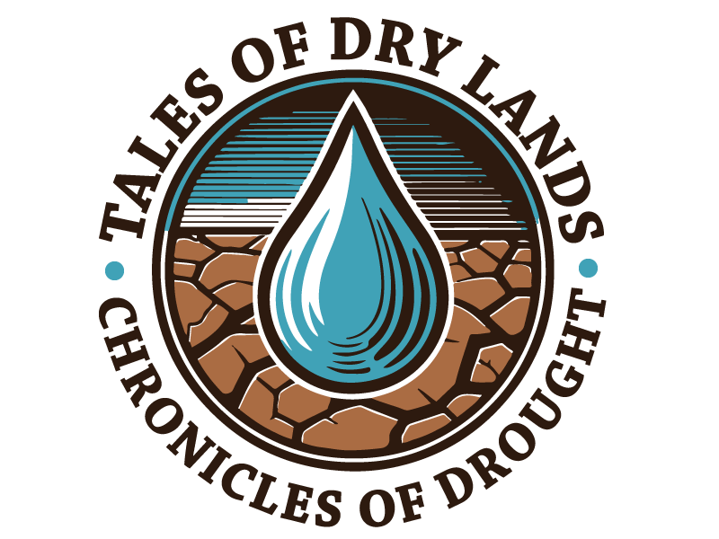

<!-- PROJECT LOGO -->
<br />
<div align="center">
    
</div>

  <h3 align="center">Tales Of Dry Lands</h3>

  <p align="center">
    Understanding drought events on Earth through a series of drought stories.

## Getting Started

1. **Clone the repository:**

   ```bash
   git clone https://github.com/ECMWFCode4Earth/tales-of-drought.git
   cd tales-of-drought
   ```

## Project structure

tales-of-drought/  
│ ├── handbook/ # Jupyter book with notebooks for analysis  
│ ├── chapters  
│ │ ├── 01-climate-toolkit-for-beginners  
│ │ ├── 02-drought-focus  
│ │ ├── 03-get-data  
│ │ ├── 04-set-up-env  
│ │ ├── 05-notebook-time-machine  
│ │ │ ├── notebook-time-machine.ipynb  
│ │ │ ├── notebook-mapping-current-global-drought-events.ipynb  
│ │ │ └── notebook-focus-madagascar.ipynb  
│ │ ├── 06-notebook-quantum-of-drought  
│ │ │ └── notebook-quantum-of-drought.ipynb  
│ │ ├── 07-notebook-solving-puzzle  
│ │ │ └── notebook-solving-puzzle.ipynb  
│ │ └── shared  
│ ├── images # images related to the handbook  
│ └── credits-license.md  
├── images/ # images related to the project  
├── requirements.txt # Required Python packages  
├── README.md # Project overview and instructions  
└── LICENSE # Project license  


## The key notebooks include:

notebook-time-machine.ipynb: recognize drought events around the world and over time.
notebook-mapping-current-global-drought-events.ipynb: identify current drought events.
notebook-focus-madagascar.ipynb: monitor drought in Madagascar.
notebook-quantum-of-drought.ipynb: quantify the severity and anomalies of drought events.
notebook-solving-puzzle.ipynb: identify and exploring the primary drivers of drought conditions.


## License
This project is licensed under the Apache License, Version 2.0 - see the [LICENSE file](https://raw.githubusercontent.com/ECMWFCode4Earth/tales-of-drought/master/LICENSE) for details.


## Acknowledgments
Data from the [**ERA5-DROUGHT**](https://cds.climate.copernicus.eu/cdsapp#!/dataset/dderived-drought-historical?tab=overview), which is derived from the ERA5 reanalysis provided by the European Centre for Medium-Range Weather Forecasts (ECMWF).
Open-source Python libraries that make data analysis and visualization easy and accessible.
