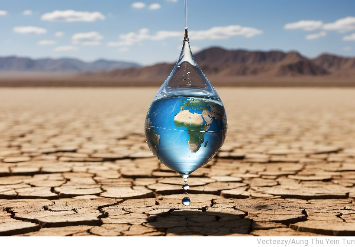

<!-- Improved compatibility of back to top link: See: https://github.com/othneildrew/Best-README-Template/pull/73 -->
<a name="readme-top"></a>
<!--
*** Thanks for checking out the Best-README-Template. If you have a suggestion
*** that would make this better, please fork the repo and create a pull request
*** or simply open an issue with the tag "enhancement".
*** Don't forget to give the project a star!
*** Thanks again! Now go create something AMAZING! :D
-->


<!-- PROJECT SHIELDS -->
<!--
*** I'm using markdown "reference style" links for readability.
*** Reference links are enclosed in brackets [ ] instead of parentheses ( ).
*** See the bottom of this document for the declaration of the reference variables
*** for contributors-url, forks-url, etc. This is an optional, concise syntax you may use.
*** https://www.markdownguide.org/basic-syntax/#reference-style-links
-->

[//]: # ([![Contributors][contributors-shield]][contributors-url])

[//]: # ([![Forks][forks-shield]][forks-url])

[//]: # ([![Stargazers][stars-shield]][stars-url])

[//]: # ([![Issues][issues-shield]][issues-url])

[//]: # ([![MIT License][license-shield]][license-url])

[//]: # ([![LinkedIn][linkedin-shield]][linkedin-url])


<div align="center">

</div>

<!-- PROJECT LOGO -->
<br />
<div align="center">
    


  <h3 align="center">Tales Of Dry Lands</h3>

  <p align="center">
    Understanding drought events on Earth through a series of drought stories.

[//]: # (    <br />)

[//]: # (    <a href="https://github.com/othneildrew/Best-README-Template"><strong>Explore the docs »</strong></a>)

[//]: # (    <br />)

[//]: # (    <br />)

[//]: # (    <a href="https://github.com/othneildrew/Best-README-Template">View Demo</a>)

[//]: # (    ·)

[//]: # (    <a href="https://github.com/othneildrew/Best-README-Template/issues/new?labels=bug&template=bug-report---.md">Report Bug</a>)

[//]: # (    ·)

[//]: # (    <a href="https://github.com/othneildrew/Best-README-Template/issues/new?labels=enhancement&template=feature-request---.md">Request Feature</a>)
  </p>
</div>


[//]: # (<!-- TABLE OF CONTENTS -->)

[//]: # (<details>)

[//]: # (  <summary>Table of Contents</summary>)

[//]: # (  <ol>)

[//]: # (    <li>)

[//]: # (      <a href="#about-the-project">About The Project</a>)

[//]: # (      <ul>)

[//]: # (        <li><a href="#built-with">Built With</a></li>)

[//]: # (      </ul>)

[//]: # (    </li>)

[//]: # (    <li>)

[//]: # (      <a href="#getting-started">Getting Started</a>)

[//]: # (      <ul>)

[//]: # (        <li><a href="#prerequisites">Prerequisites</a></li>)

[//]: # (        <li><a href="#installation">Installation</a></li>)

[//]: # (      </ul>)

[//]: # (    </li>)

[//]: # (    <li><a href="#usage">Usage</a></li>)

[//]: # (    <li><a href="#roadmap">Roadmap</a></li>)

[//]: # (    <li><a href="#contributing">Contributing</a></li>)

[//]: # (    <li><a href="#license">License</a></li>)

[//]: # (    <li><a href="#contact">Contact</a></li>)

[//]: # (    <li><a href="#acknowledgments">Acknowledgments</a></li>)

[//]: # (  </ol>)

[//]: # (</details>)


<!-- ABOUT THE PROJECT -->
## About The Project

[//]: # ([![Product Name Screen Shot][product-screenshot]]&#40;https://example.com&#41;)
<div align="center"> 
<a href="https://www.vecteezy.com/photo/42113602-ai-generated-a-concept-of-water-crisis-and-climate-changes" target="_blank" rel="noopener noreferrer"> 
    
    </a>
    <br/>
    <br/>
</div>


In a world increasingly challenged by erratic weather conditions, the 'Tales of Dry Lands' project, a series of Python notebooks, 
offers a way to understand climate data concerning droughts. Whether you're a citizen, a student, or a passionate environmentalist, 
this guide enables you to learn how to visualize trends and explore complex climatic patterns of droughts.


<p align="right">(<a href="#readme-top">back to top</a>)</p>


[//]: # (### Built With)

[//]: # ()
[//]: # (This section should list any major frameworks/libraries used to bootstrap your project. Leave any add-ons/plugins for the acknowledgements section. Here are a few examples.)

[//]: # ()
[//]: # (* [![Next][Next.js]][Next-url])

[//]: # (* [![React][React.js]][React-url])

[//]: # (* [![Vue][Vue.js]][Vue-url])

[//]: # (* [![Angular][Angular.io]][Angular-url])

[//]: # (* [![Svelte][Svelte.dev]][Svelte-url])

[//]: # (* [![Laravel][Laravel.com]][Laravel-url])

[//]: # (* [![Bootstrap][Bootstrap.com]][Bootstrap-url])

[//]: # (* [![JQuery][JQuery.com]][JQuery-url])

[//]: # ()
[//]: # (<p align="right">&#40;<a href="#readme-top">back to top</a>&#41;</p>)


<!-- GETTING STARTED -->
## Getting Started

[//]: # ()
[//]: # (This is an example of how you may give instructions on setting up your project locally.)

[//]: # (To get a local copy up and running follow these simple example steps.)

[//]: # ()
[//]: # (### Prerequisites)

[//]: # ()
[//]: # (This is an example of how to list things you need to use the software and how to install them.)

[//]: # (* npm)

[//]: # (  ```sh)

[//]: # (  npm install npm@latest -g)

[//]: # (  ```)

### Installation

[//]: # (_Below is an example of how you can instruct your audience on installing and setting up your app. This template doesn't rely on any external dependencies or services._)

[//]: # ()
[//]: # (1. Get a free API Key at [https://example.com]&#40;https://example.com&#41;)

[//]: # (2. Clone the repo)

[//]: # (   ```sh)

[//]: # (   git clone https://github.com/your_username_/Project-Name.git)

[//]: # (   ```)

[//]: # (3. Install NPM packages)

[//]: # (   ```sh)

[//]: # (   npm install)

[//]: # (   ```)

[//]: # (4. Enter your API in `config.js`)

[//]: # (   ```js)

[//]: # (   const API_KEY = 'ENTER YOUR API';)

[//]: # (   ```)

[//]: # ()
[//]: # (<p align="right">&#40;<a href="#readme-top">back to top</a>&#41;</p>)


<!-- USAGE EXAMPLES -->
## Usage

[//]: # ()
[//]: # (Use this space to show useful examples of how a project can be used. Additional screenshots, )

[//]: # (code examples and demos work well in this space. You may also link to more resources.)

[//]: # ()
[//]: # (_For more examples, please refer to the [Documentation]&#40;https://example.com&#41;_)

[//]: # ()
[//]: # (<p align="right">&#40;<a href="#readme-top">back to top</a>&#41;</p>)


<!-- ROADMAP -->
## Roadmap

- [ ] Setup of a structured jupyter book
  - [ ] environment setup
  - [ ] installation and test execution
  - [ ] data access configuration 
  - [ ] load test data sets
  - [ ] basic visualization
- [ ] Development of storyline skeletons
  - [ ] select past drought events 
  - [ ] mapping and the temporal evolution of individual drought events
  - [ ] extent and the intensity of drought events
  - [ ] local to global ranking of drought events 
- [ ] Implementation of basic storyline analysis
- [ ] Enhance visualisations and add interactive tools for storyline
exploration
  - [ ] interactive tools and graphics
  - [ ] explore other drought events using the same visuals and storylines
- [ ] Finalization and documentation
  - [ ] summary of key findings, takeaways, or lessons learned
  - [ ] recommendations or further steps for users to explore on their own

[//]: # (See the [open issues]&#40;https://github.com/othneildrew/Best-README-Template/issues&#41; for a full list of proposed features &#40;and known issues&#41;.)

<p align="right">(<a href="#readme-top">back to top</a>)</p>


<!-- CONTRIBUTING -->

[//]: # (## Contributing)

[//]: # ()
[//]: # (Contributions are what make the open source community such an amazing place to learn, inspire, and create. Any contributions you make are **greatly appreciated**.)

[//]: # ()
[//]: # (If you have a suggestion that would make this better, please fork the repo and create a pull request. You can also simply open an issue with the tag "enhancement".)

[//]: # (Don't forget to give the project a star! Thanks again!)

[//]: # ()
[//]: # (1. Fork the Project)

[//]: # (2. Create your Feature Branch &#40;`git checkout -b feature/AmazingFeature`&#41;)

[//]: # (3. Commit your Changes &#40;`git commit -m 'Add some AmazingFeature'`&#41;)

[//]: # (4. Push to the Branch &#40;`git push origin feature/AmazingFeature`&#41;)

[//]: # (5. Open a Pull Request)

[//]: # ()
[//]: # (<p align="right">&#40;<a href="#readme-top">back to top</a>&#41;</p>)


<!-- LICENSE -->
## License

This project is licensed under the Apache-2.0 License - see the LICENSE file for details.

<p align="right">(<a href="#readme-top">back to top</a>)</p>


<!-- CONTACT -->
## Contact

[//]: # (Your Name - [@your_twitter]&#40;https://twitter.com/your_username&#41; - email@example.com)

[//]: # ()
[//]: # (Project Link: [https://github.com/your_username/repo_name]&#40;https://github.com/your_username/repo_name&#41;)

[//]: # ()
[//]: # (<p align="right">&#40;<a href="#readme-top">back to top</a>&#41;</p>)


<!-- ACKNOWLEDGMENTS -->
## Acknowledgments

[//]: # (Use this space to list resources you find helpful and would like to give credit to. I've included a few of my favorites to kick things off!)

[//]: # ()
[//]: # (* [Choose an Open Source License]&#40;https://choosealicense.com&#41;)

[//]: # (* [GitHub Emoji Cheat Sheet]&#40;https://www.webpagefx.com/tools/emoji-cheat-sheet&#41;)

[//]: # (* [Malven's Flexbox Cheatsheet]&#40;https://flexbox.malven.co/&#41;)

[//]: # (* [Malven's Grid Cheatsheet]&#40;https://grid.malven.co/&#41;)

[//]: # (* [Img Shields]&#40;https://shields.io&#41;)

[//]: # (* [GitHub Pages]&#40;https://pages.github.com&#41;)

[//]: # (* [Font Awesome]&#40;https://fontawesome.com&#41;)

[//]: # (* [React Icons]&#40;https://react-icons.github.io/react-icons/search&#41;)

[//]: # ()
[//]: # (<p align="right">&#40;<a href="#readme-top">back to top</a>&#41;</p>)


[//]: # (<!-- MARKDOWN LINKS & IMAGES -->)

[//]: # (<!-- https://www.markdownguide.org/basic-syntax/#reference-style-links -->)

[//]: # ([contributors-shield]: https://img.shields.io/github/contributors/othneildrew/Best-README-Template.svg?style=for-the-badge)

[//]: # ([contributors-url]: https://github.com/othneildrew/Best-README-Template/graphs/contributors)

[//]: # ([forks-shield]: https://img.shields.io/github/forks/othneildrew/Best-README-Template.svg?style=for-the-badge)

[//]: # ([forks-url]: https://github.com/othneildrew/Best-README-Template/network/members)

[//]: # ([stars-shield]: https://img.shields.io/github/stars/othneildrew/Best-README-Template.svg?style=for-the-badge)

[//]: # ([stars-url]: https://github.com/othneildrew/Best-README-Template/stargazers)

[//]: # ([issues-shield]: https://img.shields.io/github/issues/othneildrew/Best-README-Template.svg?style=for-the-badge)

[//]: # ([issues-url]: https://github.com/othneildrew/Best-README-Template/issues)

[//]: # ([license-shield]: https://img.shields.io/github/license/othneildrew/Best-README-Template.svg?style=for-the-badge)

[//]: # ([license-url]: https://github.com/othneildrew/Best-README-Template/blob/master/LICENSE.txt)

[//]: # ([linkedin-shield]: https://img.shields.io/badge/-LinkedIn-black.svg?style=for-the-badge&logo=linkedin&colorB=555)

[//]: # ([linkedin-url]: https://linkedin.com/in/othneildrew)

[//]: # ([product-screenshot]: images/screenshot.png)

[//]: # ([Next.js]: https://img.shields.io/badge/next.js-000000?style=for-the-badge&logo=nextdotjs&logoColor=white)

[//]: # ([Next-url]: https://nextjs.org/)

[//]: # ([React.js]: https://img.shields.io/badge/React-20232A?style=for-the-badge&logo=react&logoColor=61DAFB)

[//]: # ([React-url]: https://reactjs.org/)

[//]: # ([Vue.js]: https://img.shields.io/badge/Vue.js-35495E?style=for-the-badge&logo=vuedotjs&logoColor=4FC08D)

[//]: # ([Vue-url]: https://vuejs.org/)

[//]: # ([Angular.io]: https://img.shields.io/badge/Angular-DD0031?style=for-the-badge&logo=angular&logoColor=white)

[//]: # ([Angular-url]: https://angular.io/)

[//]: # ([Svelte.dev]: https://img.shields.io/badge/Svelte-4A4A55?style=for-the-badge&logo=svelte&logoColor=FF3E00)

[//]: # ([Svelte-url]: https://svelte.dev/)

[//]: # ([Laravel.com]: https://img.shields.io/badge/Laravel-FF2D20?style=for-the-badge&logo=laravel&logoColor=white)

[//]: # ([Laravel-url]: https://laravel.com)

[//]: # ([Bootstrap.com]: https://img.shields.io/badge/Bootstrap-563D7C?style=for-the-badge&logo=bootstrap&logoColor=white)

[//]: # ([Bootstrap-url]: https://getbootstrap.com)

[//]: # ([JQuery.com]: https://img.shields.io/badge/jQuery-0769AD?style=for-the-badge&logo=jquery&logoColor=white)

[//]: # ([JQuery-url]: https://jquery.com )