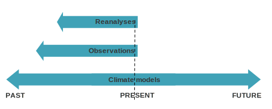

# The climate data sources

Working with climate data, we will encounter the following definitions: observations, reanalyses, and climate models. What do they mean, and what are the differences?  
These represent three major categories of data sources, and the choice of which one to use depends on the time period we are interested in.




## Observations

The **observations** measure the variables at specific times and places. They can be obtained with in-situ technologies, such as ground stations, or with remote technologies, such as satellite and radars.  
The observations are defined **direct** when the variables are measured directly, and **indirect** when they are inferred from other observations.


<p class="credits">Observation components of the Global Observing System - ECMWF</p>


## Climate models

The second category of data sources comprises climate models, which are mathematical representations used to comprehend and forecast climate systems. These models vary, each designed to examine distinct facets of the climate.  
With the advancement of computing capabilities over recent decades, these models have also grown more complex. 
These models don't predict specific events at particular times or locations, but are used for assessing how average and extreme climate conditions are expected to shift.


### The climate model grid

Even if the computing power has increased, it is however impossible to compute the climate state of every possible points on the planet. What the models do is to compute the climate state of regularly spaced points, creating *de facto* a grid with each point at the center of its cell. The value is considered to be an average of the grid cell.

When dealing with climate data, we have to consider that climate is related not only to the Earth surface (that we have already seen how it can be represented through a system of coordinates), but also to atmospheric conditions. So we have to add a third dimension to our system, named ‘height’ or ‘pressure’ and also divided into cells.

However, climate evolves over time, so we must consider it as a fourth dimension.


 # TODO: add information about drought data.

 ```{tip} 
If you are interested to learn more about climate data sources, you can watch the three ECMWF's course:
- [Data Resources - Observations](https://learning.ecmwf.int/course/view.php?id=64)
- [Data Resources - Reanalyses](https://learning.ecmwf.int/course/view.php?id=63)
- [Data Resources - Climate Models](https://learning.ecmwf.int/course/view.php?id=62)

Or you can visit the "[Observation components of the Global Observing System](https://community.wmo.int/en/observation-components-global-observing-system)" page of the World Meteorological Organization (WMO).
```