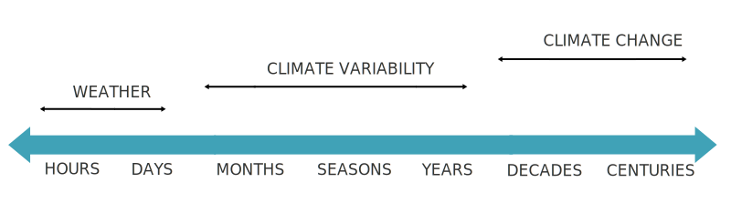
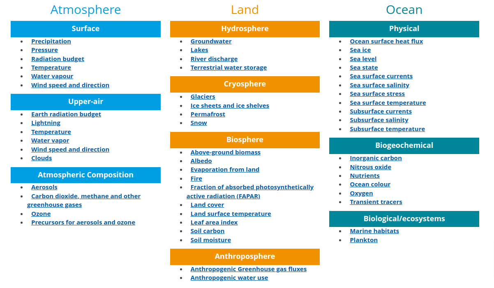
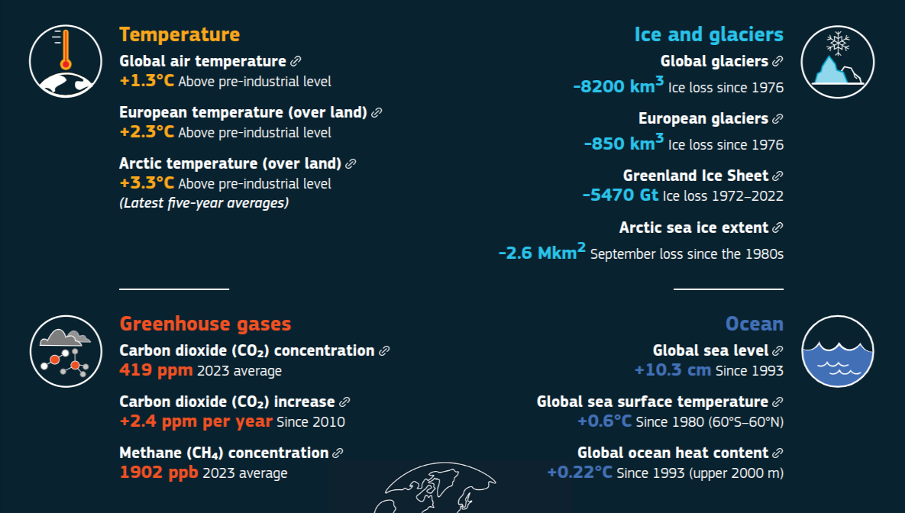

# What is climate?

The terms "**climate**" and "**weather**" are often used interchangeably, but they hold distinctly different meanings for climate scientists. 

*Weather* describes atmospheric conditions over short periods, typically spanning hours to days. 

In contrast, **climate** refers to the average behavior of the atmosphere over much longer periods, ranging from years to decades, and sometimes even centuries. Typically, climatologists use a **30-year period** as a standard to gather robust statistics and maintain stable climate conditions.

Between the scales of weather and climate lies the concept of **climate variability**, also known as climate **anomaly**. This measures the deviations of a particular season's or year's condition from the climatological average for that period.




The choice of data — whether focusing on weather, climate or climate variability — depends on the specific research question being addressed. For our drought analysis, we will consider only climate and climate variability data.


```{tip} 
If you're interested in this topic, sign up for the free "[Climate Data Discovery – Introduction](https://learning.ecmwf.int/course/view.php?id=67)" course on the ECMWF eLearning website.
```

## Climate variables and indicators

What factors allow us to understand the climate and recognize changes in it? 

A panel of meteorologists and climate scientists from around the world has identified 55 **Essential Climate Variables** (ECVs). These variables are consistently monitored to capture a detailed picture of Earth's climate. 




Additionally to these variables, there is a select number of **Climate Indicators**. These indicators offer crucial insights into the most significant aspects of climate change, helping us understand its impact across various domains.

```{tip} 
- To learn all about the ECVs and understand their purposes, visit the [Global Climate Observing System (GCOS) website](https://gcos.wmo.int/en/essential-climate-variables/).
- To know more about the Climate Indicators, have a look at the [Copernicus/ECMWF page](https://climate.copernicus.eu/climate-indicators)
```

