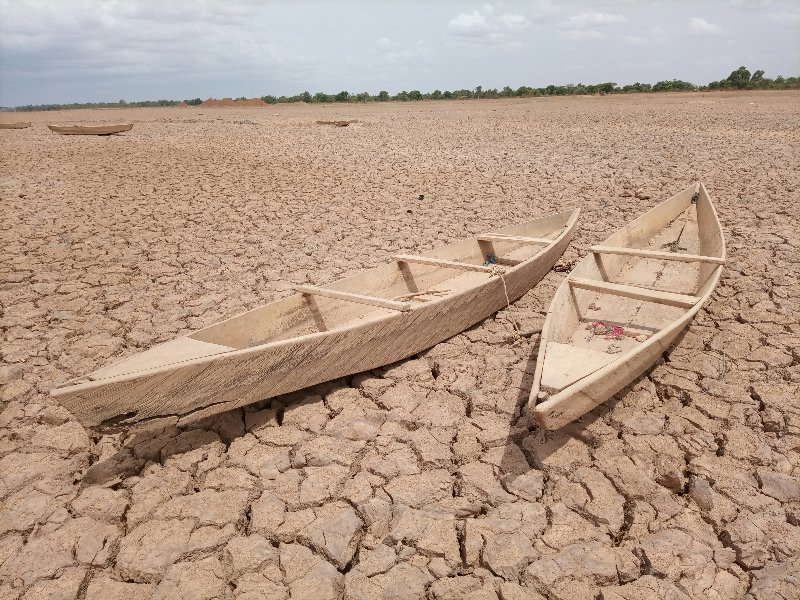

# Droughts and their impacts

**Droughts** represent one of the most pervasive and impactful natural disasters worldwide.

The repercussions of drought extend far beyond mere water shortages, encompassing a myriad of socio-economic, environmental, and humanitarian challenges. With climate change exacerbating weather patterns and altering precipitation distribution, regions across the globe are experiencing more frequent and severe drought events. 

These phenomena disrupt agricultural productivity, threaten food security, exacerbate water conflicts, and amplify socio-economic disparities, particularly in vulnerable communities. 

Furthermore, drought-induced water scarcity has profound implications for ecosystems, leading to biodiversity loss, habitat degradation, and ecosystem instability. 


<p class="credits">Photo by <a href="https://unsplash.com/@adam_yod?utm_content=creditCopyText&utm_medium=referral&utm_source=unsplash">YODA Adaman</a> on <a href="https://unsplash.com/photos/brown-wooden-boat-on-brown-sand-during-daytime-8wuOLdN77A4?utm_content=creditCopyText&utm_medium=referral&utm_source=unsplash">Unsplash</a></p>


In urban areas, water shortages can disrupt industries, compromise sanitation, and strain infrastructure resilience. Addressing the multifaceted impacts of drought in today's world necessitates holistic approaches, encompassing sustainable water management strategies, climate resilience measures, and proactive community engagement to mitigate risks and build resilience against future drought events.


## The 4 drought stages

<div class="iframe_ctn">
    <iframe width="560" height="315" src="https://www.youtube.com/embed/2jmj4w37Vos?si=5rqUGRKMcxcp4yuj" title="YouTube video player" frameborder="0" allow="accelerometer; autoplay; clipboard-write; encrypted-media; gyroscope; picture-in-picture; web-share" referrerpolicy="strict-origin-when-cross-origin" allowfullscreen></iframe>
    <p class="credits">World Meteorological Organization - WMO</p>
</div>

```{tip} 
You can learn more about drought's impacts in these two reports:
- "[Atlas of Mortality and Economic Losses from Weather and Climate Extremes (1970-2012)](https://wmo.int/about-us/world-meteorological-day/wmd-2020/drought)" by the World Meteorological Organization (WMO).
- "[Global Drought Snapshot 2023](https://www.unccd.int/sites/default/files/2023-12/Global%20drought%20snapshot%202023.pdf)" by the United Nations Convention to Combat Desertification (UNCCD). On page 12, you can find the list of countries declaring drought emergencies in 2022-2023.
```